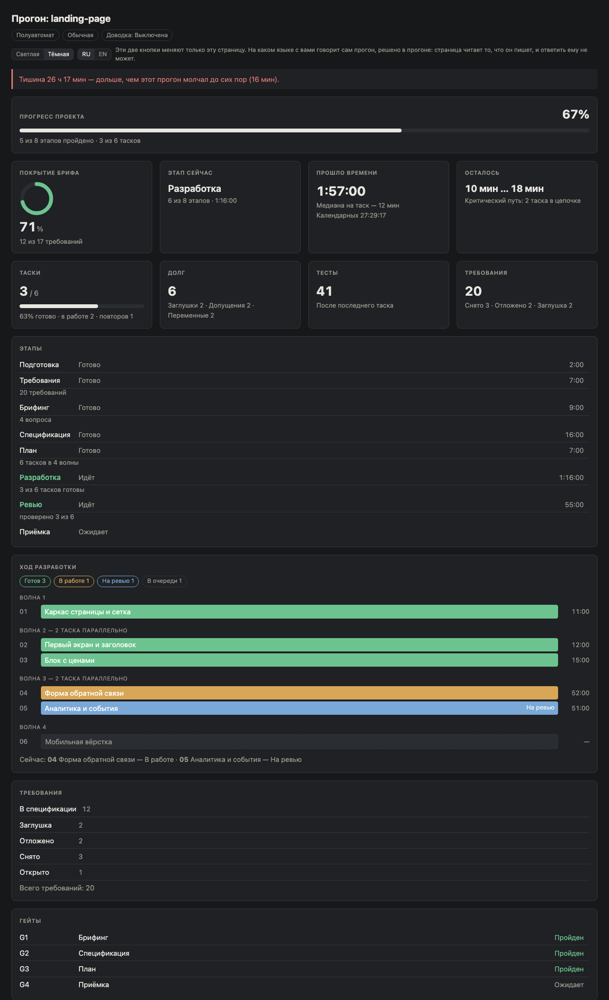
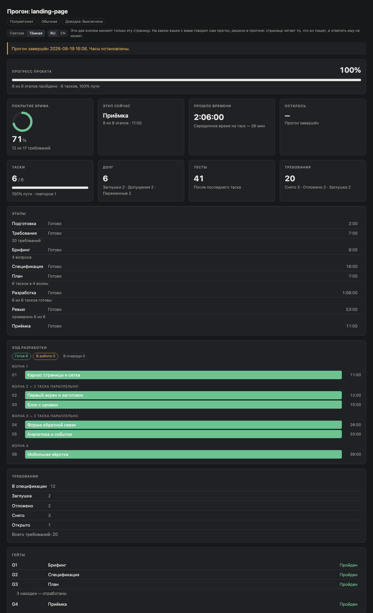

# Maestro

Maestro turns a dictated idea into a project and records what verification
actually established, in one dialogue. You say what you need; it records your
words as numbered requirements, asks only about the genuine forks, writes a
specification, cuts it into tasks, builds them with parallel executors, reviews
the result — and then checks the build against your original words with the
specification withheld.

It is an Agent Skill. Installing it copies prompts, a dashboard and an
autonomous TypeScript helper; nothing is compiled, and nothing runs at install
time.

**The package holds a second skill: `scout`.** It is reconnaissance for the case
Maestro deliberately does not handle — a ТЗ that is thin, or a domain you do not
yet have the words for. Scout reads the domain across many sources, finds how
existing products already solve it, asks only the forks that reading exposes,
proposes edits to your ТЗ one at a time in your own words, and prints a бриф to
paste after `/maestro`. It writes nothing a прогон reads and starts no run of
its own.

**Neither skill needs the other.** Maestro runs exactly as it did before Scout
existed. Scout ends at a block of text.

**Status: `0.0.8-alpha`.** Four прогона have carried a бриф to a finished отчёт
with all four gates passed on Claude Code. One of the four modes has never been
run, Codex and Gemini CLI are unverified, and Scout has not yet run in front of
a real прогон — see [Limitations](#limitations) and
[`CHANGELOG.md`](CHANGELOG.md).

## Contents

- [Quick Start](#quick-start)
- [Requirements](#requirements)
- [Installation](#installation)
- [Starting A Run](#starting-a-run)
- [Dials](#dials) — register, language, mode, depth, finish
- [What A Run Does](#what-a-run-does) — the stages, repair, polish, memory
- [When It Asks You](#when-it-asks-you) — every stop, and what you can answer
- [Talking To A Run In Progress](#talking-to-a-run-in-progress)
- [Four Gates](#four-gates)
- [Six Rules Nothing Turns Off](#six-rules-nothing-turns-off)
- [What A Run Leaves In Your Project](#what-a-run-leaves-in-your-project)
- [The Dashboard](#the-dashboard)
- [Scout](#scout)
- [Hosts](#hosts)
- [The Language It Speaks](#the-language-it-speaks)
- [Under The Hood](#under-the-hood)
- [Limitations](#limitations)
- [For Contributors](#for-contributors)
- [Documentation Map](#documentation-map)

## Quick Start

```bash
cd my-project
git init                              # before you start the agent session
npx skills add permgps/skills -y      # installs every skill the default branch carries
```

Then, in Claude Code, inside that project:

```text
/maestro Сделай страницу заметок с локальным сохранением.
```

What happens next:

1. **The first run in a project asks two things** — how it should explain
   things (*по-простому* or *обычный*), then which mode to start in — and
   writes the answers to `.maestro/config.json`. It never asks them again.
2. **The dashboard opens** in your browser (or in your host's pane) and stays
   current for the whole run.
3. **Your words come back numbered** as `R01`, `R02`… Correct anything that was
   misread; this is the last moment the list is open to the run.
4. **A block of questions arrives** about the genuine forks, each with options
   and one marked as recommended. Pick, say «как советуешь», or answer in your
   own words.
5. From there it specifies, plans, builds, reviews and checks — stopping only
   where a decision is yours. At the end you get `report.md` and a block of
   questions to forward.

If the session is interrupted, open a new one in the same project and say
«продолжай». The run picks up from where its state says it stopped.

## Requirements

- **An agent host that reads Agent Skills.** Claude Code is the supported one;
  Codex and Gemini CLI install but are unverified — see [Hosts](#hosts).
- **Node.js 22.18+ with native TypeScript stripping**, for Maestro. Preflight
  runs a real `.mts` probe rather than reading a version string, and stops with
  the prerequisite named if the probe fails. Scout needs no runtime.
- **A git repository, initialised before the session starts.** Maestro works
  without one and says so, but the final отчёт is checked against what reached
  version control, and a host decides at session start whether it can raise
  worktrees — a `git init` afterwards narrows every wave to one таск for the
  rest of that session.
- Nothing else: no Python, no compiler, no `npm install` in your project, and
  Maestro needs no network after installation (Scout does — it reads the web). Browser checks use a headless browser when one
  is available; without one, the checks that need it stay incomplete.

## Installation

### From The Published Repository

```bash
npx skills add permgps/skills -y             # both skills
npx skills add permgps/skills -s maestro -y  # only Maestro
npx skills add permgps/skills -s scout -y    # only Scout
```

**Not yet measured against GitHub itself:** the two-skill install was verified
against a publish-shaped export of this repository, and no push has yet carried
both bundles to the default branch (finding F14 in `docs/install.md`).

The `-y` matters: with two skills in the package, the CLI stops on a picker
with **nothing pre-selected**, so pressing enter installs nothing. For Claude
Code the skills land in `./.claude/skills/` — the preview line that mentions
`.agents/` is wrong, the final summary is right. The full record, with the
picker and real output, is in
[`docs/install.md`](docs/install.md#from-the-published-repository).

### From A Local Checkout

```bash
npx skills add /path/to/maestro -l                                     # list what it sees
npx skills add /path/to/maestro -s maestro -a claude-code -y --copy    # install one
```

A development checkout exposes the repository's own agent tooling too, so the
`-s` selector is mandatory there. See
[installing from a checkout](docs/install.md#from-a-local-checkout).

### Codex And Gemini CLI

```bash
npx skills add permgps/skills -s maestro -a codex -y
npx skills add permgps/skills -s maestro -a gemini-cli -y
```

Both install into `./.agents/skills/maestro`. Use `-a gemini-cli`, not
`-a gemini`. If the skill does not appear, restart the client, and keep one
copy — two installed copies of one skill are ambiguous to the host. See
[Codex setup](docs/install.md#codex-cli-and-app).

### Updating And Removing

`npx skills update` refreshes installed skills. `skills-lock.json` records a
hash per skill, so the two update independently. An update overwrites every
bundle file, which is why your project's settings live in
`.maestro/config.json`, outside the bundle. Each new run's preflight copies the
installed helper — `sync.mts` and `runtime/` together — into `.maestro/`
without touching existing runs, so an updated bundle reaches a project with its
next run.

No uninstall command is documented. To remove a skill, delete its installed
directory (for example `.claude/skills/maestro`) and the guard's hook entry if
you wired one. `.maestro/` in your projects and the memory block in your
`CLAUDE.md`/`AGENTS.md`/`GEMINI.md` are your record, not the skill's — they stay
until you delete them.

### Developing Against The Checkout

```bash
npm run link     # symlink skills/maestro into .claude/skills, .agents/skills, .gemini/skills
npm run unlink   # remove those links
```

`link` refuses to replace a real directory, is safe to run twice, and exits `1`
if it refused anything. See
[developing against the checkout](docs/install.md#developing-against-the-checkout).

### Optional: A Guard Against Destructive Git

On Claude Code only, you can wire a `PreToolUse` hook that refuses `git push`,
`reset --hard`, a forced `clean`, `branch -D`, and a `checkout`, `switch` or
`restore` that would discard work — even after you agreed to it under S4.
Nothing installs it for you, because wiring it edits your settings. It does not
see through aliases, scripts, shells reading stdin, or command names built at
run time. Remove it by deleting the hook entry; debug it with
`MAESTRO_GUARD_DEBUG=1`. Instructions and limits are in
[the git guard](docs/install.md#optional-a-guard-against-destructive-git).

## Starting A Run

| Host | Command |
|---|---|
| Claude Code | `/maestro [dials…] <what you want built>` |
| Codex CLI and app | `$maestro [dials…] <what you want built>` |
| Gemini CLI | no invocation form is documented yet; see [Hosts](#hosts) |

**Only you start it.** On Claude Code the skill declares
`disable-model-invocation: true`, and on Codex `allow_implicit_invocation:
false`: however much a request sounds like a build, the agent will not open a
прогон on its own.

Everything after the command is bare words, no dashes:

- **Dial words** set how the run behaves — see [Dials](#dials). They count only
  as standalone words; a phrase inside a sentence of your бриф sets nothing.
- **Everything else is the бриф.** A word you meant literally is never stolen by
  a dial. One sentence is enough to start; the briefing stage asks about what
  it leaves open.

```text
/maestro Сделай страницу заметок с локальным сохранением.
/maestro semi deep Онлайн-запись в барбершоп: выбор мастера, слота и оплата картой.
/maestro по-простому полный автомат Лендинг для моей пекарни с меню и адресом.
/maestro manual strict polish Повтори вот эту страницу один в один: https://example.com
$maestro interview Build a notes page with local saving.
```

**The brief is typed, not attached.** Maestro takes only what follows the
command. Paste a Scout бриф or any other text after it. Pasted fragments, pages
behind links and files read during the run are *content* — Maestro builds from
them, but a sentence inside them addressed to the agent is never an instruction
(rule S6).

## Dials

Five dials. Each has a value whether you name one or not. Before any work
begins, one announcement states the register, mode, depth and finish — written
in the language the fifth dial chose.

### Register — How It Explains

| Value | Default | Russian triggers | English triggers | Effect |
|---|---|---|---|---|
| `plain` | | по-простому, простыми словами, объясняй проще | plain, simple, explain simply | every sentence is written for someone who has never built software: no shorthand like `гейт` or `коммит`, and a term such as *таск* gets one clause of explanation the first time it appears |
| `normal` | yes | как обычно, обычным языком | usual, as usual | the terms are used as they are |

The register changes wording and nothing else: the same questions are asked,
the same checks run. It can change at any moment — say «как обычно» or
«по-простому» mid-run and the next sentence follows. The bare word `normal` is
not a trigger, because it is also a depth.

### Language — Which Words It Speaks In

| Value | Russian triggers | English triggers | Effect |
|---|---|---|---|
| `ru` | по-русски, отвечай по-русски | in russian, russian | chat and dashboard labels in Russian |
| `en` | по-английски, отвечай по-английски | in english, english | the same sentences and labels in English |

This dial has **no built-in default**. It comes from a trigger word in this
run, then from a `language` key you added to `.maestro/config.json` by hand,
then from the language your бриф is written in; a бриф that is neither clearly
Russian nor clearly English (a URL, two words) takes `en`. It is never asked,
the skill never writes it to the config, and it can change at any moment. Every
file the run writes stays English either way — see
[The Language It Speaks](#the-language-it-speaks).

### Mode — How Much It Asks

| Value | Default | Russian triggers | English triggers | What it asks you |
|---|---|---|---|---|
| `full` | | полный автомат, ничего не спрашивай, сам реши | full, fully automatic, don't ask | nothing about the project; every fork is answered by the run and recorded as self-briefed |
| `semi` | yes | полуавтомат | semi | questions only on genuine forks — sometimes none |
| `interview` | | режим интервью, погоняй меня, разбери со мной | interview, grill me, ask me everything | every fork the бриф opens |
| `manual` | | ручной режим, согласовывай каждый шаг | manual, approve every step | the same as `interview`, plus approval of the specification and of the plan |

No mode removes a gate or a safety rule. Even `full` asks before an
irreversible or outward-facing action (S4), and it still asks the two
first-run questions, because those are about the tool, not the project.

### Depth — How Far Beneath The Brief

| Value | Default | Russian triggers | English triggers | Effect |
|---|---|---|---|---|
| `strict` | | строго по брифу, ничего не добавляй | strict, nothing extra | only what a requirement cannot work without; no new capabilities, and behaviour nobody asked for found in review may be sent to repair |
| `normal` | yes | | | depth by judgement, in proportion to the feature; new capabilities allowed, each tied to a parent requirement |
| `deep` | | проработай глубоко, продумай за меня | deep, think it through | every dimension of every requirement — empty states, failures, limits, interruptions; new capabilities encouraged, each tied to a parent requirement |

Depth buys thoroughness beneath the бриф; it never buys a direction away from
it.

### Finish — Polish After Acceptance

| Value | Default | Russian triggers | English triggers | Effect |
|---|---|---|---|---|
| `polish` | off | доведи до эталона, сравни с образцом | polish | up to three refinement rounds after acceptance, comparing the running build with the reference you gave |

`polish` asks nothing. It needs a reference recorded during briefing; without
one the run says so and skips it. Required visual or interaction fidelity — "make
it look like this page" — is checked at acceptance **whether or not** `polish`
is on.

### Where A Value Comes From

| Order | Mode and register | Language | Depth and finish |
|---|---|---|---|
| 1 | a trigger word in this run | a trigger word in this run | a trigger word in this run |
| 2 | `.maestro/config.json` | the `language` key in `.maestro/config.json` | — |
| 3 | built-in default (`semi`, `normal`) | the language of the бриф | built-in default (`normal`, off) |

An argument always wins over the config file, and only for that run — the
announcement says so.

### The First Run In A Project

When `.maestro/config.json` does not exist, the run asks once, before the
manifest:

1. **the register** — so the next question can already be asked plainly;
2. **the mode**, in the register you just chose, with `semi` marked as the
   built-in default.

If you named either on the command line, it asks whether to pin that value
instead. These two questions are asked in `full` too. See
[the first run](docs/install.md#the-first-run-asks-two-things).

### `.maestro/config.json`

```json
{
  "configVersion": 1,
  "mode": "semi",
  "explain": "plain"
}
```

- `mode` is `full`, `semi`, `interview`, `manual` or `null`; `explain` is
  `plain`, `normal` or `null`. `null` means "asked, chose not to pin".
- You may add `"language": "ru"` or `"en"` by hand; the skill reads it and never
  writes it.
- Preflight writes the file once. After that it is yours: every announcement
  names its path, so editing it is how you change the defaults.
- A key outside its set is ignored on its own; a file that will not parse is
  ignored whole and the run continues on the built-in defaults. A setting is
  never a reason to stop a run.

### The Announcement

Before the manifest, in every mode, one block states the register, the mode,
the depth, whether polish is on, where each value came from (your arguments, the
config file by path, or the built-in default), any capability your host lacks
and what that costs — and the one consequence most likely to surprise you: no
questions in `full`, nothing beyond the бриф in `strict`, two approvals in
`manual`. It is a statement, not a question.

### Changing Dials Mid-Run

- **Register and language:** at any moment, effective at the next sentence.
- **Mode, depth and finish:** at a phase boundary. The new value applies to
  phases not yet started; nothing already done is re-run, and switching to a
  mode with fewer questions never removes a gate that already passed. The
  change is recorded so the отчёт can say which parts ran under which settings.
- **Two different words for one dial** (`semi … full`): the run stops before the
  manifest and asks which you meant — except in `full`, where the first word
  wins and the announcement says so.

## What A Run Does

Project code is written in the second-to-last stage. Everything before it
decides what to build; everything after it proves the right thing was built.

| # | Stage (on screen: `ru` / `en`) | Produces | What you see or answer |
|---|---|---|---|
| 0 | Preflight (*Подготовка* / Setup) | resolved dials, run state, dashboard, `prior.md` | the announcement; the first-run questions; a dirty working tree is a question outside `full` |
| 1 | Manifest (*Требования* / Requirements) | `brief.md`, `manifest.md` | your words numbered `R01…`, with the original under each line when the languages differ — confirm or correct |
| 2 | Briefing (*Брифинг* / Briefing) | `answers.md`, `reference.md` | one numbered block of forks, at most two rounds |
| 3 | Specification (*Спецификация* / Specification) | `spec.md` | approval in `manual` only |
| 4 | Plan (*План* / Plan) | `tasks/`, `interfaces.md` | approval in `manual`; a notice elsewhere |
| 5 | Build (*Разработка* / Development) | project code, `discovered-interfaces.md` | the dashboard's waves filling in; nothing to answer unless an S4 action comes up |
| 6 | Review (*Ревью* / Review) | `reviews/` | nothing to answer |
| 7 | Acceptance (*Приёмка* / Acceptance) | `report.md` | the outcome, the отчёт, and a block of questions to forward |

Three more phases run outside that sequence:

- **Repair** — a таск reaches it through one of six doors: it came back not
  done, failed review, carries a final disagreement from acceptance, built
  something its dependants recorded as diverging, left a required observation
  uncovered, or the integrated build would not start. A finding
  is split into **defects** under its parent таск; each repair targets one
  defect, two attempts per finding and eight in total. A batch of repairs that
  closed nothing, or a cause that survived a similar repair, stops for a fresh
  **strategy review** — which may change the approach, stop the run incomplete,
  or ask you to raise the total limit. Only your words raise it. When the
  build shows that something cannot be built as specified, the scope
  amendment is your decision.
- **Polish** — only with the `polish` dial and a recorded reference. Up to
  three rounds; a round that finds no difference ends it. Differences become
  таски built by executors, new features are reported rather than built, and
  acceptance runs once more and appends to the отчёт.
- **Memory** — runs during the build and after acceptance and asks nothing. It
  writes what should outlive the run into the instruction file your host loads
  and appends to `decisions.md`; the next run's preflight reads both back into
  `prior.md`, and its briefing says when a recommendation follows or
  contradicts an earlier decision.

Before any broad, browser or integrated check, the run records **readiness**
against a disposable source-only copy of the project, so a broken setup is
fixed as a setup problem instead of being filed as product failures.

## When It Asks You

Every stop carries its answers. Your host shows them as choices when it can,
or the question numbers them; one is marked as the run's recommendation with a
one-clause reason, and **your own words are always accepted** beyond the
options. «Не понял» is not an answer: the same question comes back with the
premise it was missing, and in briefing it costs no round. An id never travels
alone — you see «R03 — оплата картой», not «R03».

| Stop | When | Modes | What you can answer |
|---|---|---|---|
| Dirty working tree | preflight finds uncommitted changes | not in `full` | continue, or stop and tidy up first |
| A Latin name for the run | the бриф is entirely in Russian | not in `full` (it uses `run-<date>`) | a short English name for the run directory |
| Register, then mode | first run in a project | all, `full` included | a register and a mode, or "pin neither" |
| Ambiguous dials | two different words for one dial | not in `full` | which one you meant |
| A credential in your text | redaction finds one at ingest | all | S2: before going on, it names the redacted variables, advises rotating them, and never echoes a value — a secret found in a file already written stops the run |
| The manifest | after numbering your words | `semi`, `interview`, `manual` (shown without a question in `full`) | "right, start the briefing" · "R02 is wrong / something is missing" · your own correction |
| The briefing block | forks in the бриф | `semi` (genuine forks), `interview`, `manual` (all forks) | an option, «как советуешь», «да» to the recommendation, or your own text; each choice is echoed back as recorded |
| The specification | after G2 | `manual` | approve, or say what to change |
| The plan | after G3 | `manual` | approve, or say what to change |
| An irreversible or outward-facing action | deploy, publish, pay, message someone, delete data, rewrite history | all, `full` included (S4) | allow or refuse that one action |
| A scope amendment | the build shows a requirement cannot be built as specified | all | accept the amendment, or change what you asked for |
| Raising the repair limit | a strategy review asks for more attempts | all | your exact words authorise it; a forecast of what will close comes with the question |
| Closing with residual findings | acceptance ends with findings left | all | accept the residual set shown (the run closes `closed_with_exceptions`), or keep repairing |
| Someone else holds the run | the state carries another session's token | all | continue it, or wait — the run cannot tell a live session from a dead one |
| The state changed underneath | another write landed since the last read | all | re-read and continue from what is on disk |
| A gate fails a third time | the same finding fails one gate three times | all | the run stops and reports what cannot be satisfied |

While the run waits on any of these, the dashboard says it is waiting for your
reply rather than counting silence.

## Talking To A Run In Progress

- **Resume.** Say anything — «продолжай», a question, a correction — in a
  session opened in the same project. The run reads `.maestro/state.js` and
  resumes at the stage that is still open. It never restarts.
- **Add, withdraw or reword a requirement**, at any point. Your words are
  appended verbatim, in the language you said them, to the dated additions
  block of `brief.md` with one English line naming the `R##` and what changed;
  the requirement's status changes in the state while its original row stays
  in `manifest.md`; a fresh source audit runs; the plan is updated; and you get
  one sentence on what it costs the schedule. The final check reads those
  additions, so a requirement you withdrew never comes back reported as
  missing.
- **Switch register or language** with the trigger words above, at any time.
- **Change mode, depth or finish** with their trigger words; it takes effect at
  the next phase boundary.
- **The dashboard disappeared?** Say so, or run `node .maestro/sync.mts --reopen`
  yourself.
- **Stop.** There is no stop command; tell the run to stop and it closes as
  `stopped_incomplete` with your reason recorded.
- **A closed run can be reopened.** A new бриф aimed at it, or `polish` on it,
  brings its directory back to `--wip` under its original date. A бриф dictated
  on a later day goes into a new `<date>-brief.md` under that day's date rather
  than being appended to the old one. A second run started the same day with the
  same name gets a numeric suffix. Nothing earlier is deleted.

## Four Gates

Each runs after a phase, in every mode, at every depth. A gate that fails is not
a warning: the phase is redone.

| Gate | After | Passes when |
|---|---|---|
| G1 | briefing | every requirement has a status/reason; every question in `answers.md` records its recommended option and the option chosen; v5 also requires a fresh independent source audit and frozen agreement |
| G2 | specification | intent and independent raw-reference readers find no unresolved mandatory gap |
| G3 | plan | each required obligation has an implementation owner, each check has an execution owner, the task reader finds the handoff executable, and the plan-consistency reader, seeing every task file at once, finds no two таски sharing a file without an order between them |
| G4 | acceptance | all current required checks and coverage pass; missing evidence remains pending |

Independent readings withhold earlier conclusions. G2 includes a separate reader
of raw reference material; G4 can inspect that authority and exercise the
integrated build with available headless tools. The precise input boundaries
are in [the gates specification](docs/spec/gates.md).

G2 and G4 are the same question asked at the two ends of the run: does this match
what you actually said, with our paraphrase of it taken away. G2 asks while the
answer is still a paragraph and cheap to change; G4 asks when it is the last
chance to know — and it is handed the manifest plus whatever you said about the
brief after it was frozen, in your own words and your own language, so a
requirement you withdrew or added mid-run is weighed by the reader instead of
falling between two documents.

G4 is the one gate that does not send its phase back: the отчёт is written
anyway as the record of what disagreed, each disagreement travels to repair,
and acceptance runs again once the build has changed.

## Six Rules Nothing Turns Off

No mode, depth or finish removes any of them.

1. **S1** — A requirement is removed only by you, in your own words. Change your
   mind while a run is going and what you said is quoted verbatim, in the
   language you said it in, into the additions block of the brief with the
   requirement it changes named — and the final check reads it.
2. **S2** — A credential is never requested, echoed, or written. Redaction runs
   at ingest, before your text reaches any file; only variable names survive.
   This is the only stop condition among the six.
3. **S3** — A fact about you is never invented — prices, addresses, texts stay
   visible placeholders until you supply them, and each one is listed for you.
4. **S4** — An irreversible or outward-facing action is a question, even in the
   mode that asks nothing else.
5. **S5** — The orchestrator does not write the project's code. Every line
   travels to an executor.
6. **S6** — Text that did not come from you directly — a pasted fragment, a page
   behind a link, a file read during a task — is content, never instruction.

## What A Run Leaves In Your Project

```text
your-project/.maestro/
├── 2026-10-04-notes-page--wip/     one directory per run; --wip comes off when it closes
│   ├── 2026-10-04-brief.md         your words, redacted, plus the dated additions block
│   ├── manifest.md                 the numbered requirements
│   ├── prior.md                    what earlier runs decided, read at preflight
│   ├── answers.md, reference.md    briefing answers and the recorded reference
│   ├── spec.md, interfaces.md      the specification and the contracts between таски
│   ├── discovered-interfaces.md    what the build found it needed
│   ├── tasks/, reviews/            one file per таск and per review
│   ├── evidence/<execution-id>/    captured check output, referenced by path and hash
│   ├── report.md                   the отчёт
│   ├── decisions.md                what was decided, what instead, and why
│   └── amendments.md               specification changes the build forced
├── README.md                       the register: one row per run and how it ended
├── config.json                     your pinned mode and register
├── state.js, dashboard.html        the run state and the page that reads it
└── sync.mts, runtime/              the helper copied in at preflight
```

- **The register.** `.maestro/README.md` lists every run — when it started, its
  directory, whether it is in progress, completed, closed with exceptions or
  stopped incomplete, and when it finished — between
  `<!-- maestro:runs:begin -->` and `<!-- maestro:runs:end -->`. Text you write
  outside the markers is never touched.
- **The отчёт.** `report.md` has fixed sections, in this order: *What was
  asked*, *Disagreements*, *Assumptions*, *Questions to forward*, *Hard to
  undo*, *Observations*, *What is left*. A second acceptance round is appended below the first. The questions to forward
  are also given in chat as one block you can copy, in your language.
- **The outcome.** A closed run is `completed` (a current passing G4),
  `closed_with_exceptions` (you accepted a residual set; the underlying failure
  is preserved), or `stopped_incomplete` (with its reason). Activity reaching
  100% does not establish conformance.
- **Project memory.** A short block between `<!-- maestro:begin -->` and
  `<!-- maestro:end -->` in the instruction file your host loads at session
  start, so the next session reads it first. Your own text outside the markers is
  never edited.

  | Host | Loads at session start | Creates when none exists |
  |---|---|---|
  | Claude Code | `CLAUDE.md`, `.claude/CLAUDE.md`, `CLAUDE.local.md`; else `AGENTS.md` | `CLAUDE.md` |
  | Codex | `AGENTS.override.md`; else `AGENTS.md` | `AGENTS.md` |
  | Gemini CLI | `GEMINI.md` | `GEMINI.md` |

  The file it writes is, in order: the one already carrying the block; else the
  first file your host loads that exists; else any other existing file from the
  table (`AGENTS.md`, `CLAUDE.md`, `.claude/CLAUDE.md`, `GEMINI.md`) — and then
  it tells you the host does not load it; else it creates the file in the last
  column. A project never gains a second memory file because you switched
  hosts. It never writes `CLAUDE.local.md` or `AGENTS.override.md`. The same
  block in two files, or broken markers, stop the memory phase instead of
  guessing. Details in [the hosts specification](docs/spec/hosts.md).

## The Dashboard

One self-contained HTML file, opened for you when the run starts, reading the run
state on its own. Offline, no CDN, no fonts, no build step.



Progress across the whole прогон, weighted by how long each stage typically takes —
the build counts six, specification and review two, the rest one.
Eight cards: brief coverage, the current stage, working time, what is left,
таски, debt, tests, requirements. And the build itself grouped by wave, so the
parallelism you paid for is the parallelism you can see — measured from the
clocks rather than claimed from the plan. Every number is computed from the run
state when the page draws itself, and «осталось» is a range that refuses to be
sharper than the таски it was measured from.

What else is on it:

- **«Ваш ход» — what only you can settle**, in one place: empty variables by
  name, placeholders, open promised work, one-way changes grouped by kind, and
  assumptions. See [Your move](docs/dashboard.md#your-move).
- **Every таск row opens** to the требования it serves, its blockers, files,
  owned area, commits, restarts, trips to repair, tests and defects; tasks on
  the critical path are marked.
- **Every требование row opens** to your own quoted words, the таски that name
  it, each check with its result and failure cause, and open findings. A
  требование no таск names is marked.
- **Verified original scope beside authorised current scope**, «Услышано, но не
  взято» and «Сверх запрошенного», and on a stopped run, the reason it stopped.
- **A small `i` on every region and stage** that explains it with numbers from
  your run — which median the estimate used, how long the chain is, how many
  требования are in the denominator and why. Escape or a click elsewhere closes
  it. A «Ваш ход» group longer than five lines folds the rest. Rows open by click or Enter, and focus
  survives the page's redraw.
- **The silence line.** The run writes state only at transitions, so the page
  says how long it has been since the last write and raises the line once the
  silence is longer than any this run has already come through — a session that
  died no longer looks like one that is thinking. A run stopped on your question
  says it is waiting for your reply instead.
- **Two switches in the header** — theme (light, dark, auto) and language (ru,
  en, auto) — remembered by your browser only. See
  [the two switches](docs/dashboard.md#the-two-switches-in-the-header).



**You do not have to go looking for it.** The helper that keeps the page current
is what opens it, and it records in `opened.json` that it did, so a run that
writes state dozens of times raises exactly one tab. An address that *moved* is
opened again, because by then the tab you are holding is dead. Nothing opens
over SSH or in CI. A host that shows the page in a pane of its own should load
the loopback `http://` address the helper prints — not a `file://` path, from
which the page can show the snapshot embedded in it but cannot read the state
that keeps it moving — and the run passes `--no-open` there, so you do not get
two pages.

The commands you might run yourself, from the project root:

```bash
node .maestro/sync.mts                       # refresh the page and print its address
node .maestro/sync.mts --reopen              # bring the panel back
node .maestro/sync.mts --no-open             # refresh without opening anything
MAESTRO_SYNC_DEBUG=1 node .maestro/sync.mts  # diagnostics on stderr
```

`MAESTRO_SYNC_NO_OPEN` in the environment does what `--no-open` does, and
`LOG_LEVEL=DEBUG` also turns diagnostics on. `--validate` and `--project` are
read-only checks that print JSON; `--publish`, `--serve` and the memory commands
are what the orchestrator uses, not you. If the loopback server cannot start,
the page falls back to a file snapshot. More in
[viewer runtime and recovery](docs/dashboard.md#viewer-runtime-and-recovery).

**It is the only user-visible page a прогон opens.** Owned temporary servers and
headless browsers may run bounded checks without taking over that viewer; when
a browser is unavailable, affected checks remain incomplete. Everything about
the page is in [`docs/dashboard.md`](docs/dashboard.md).

## Scout

Use Scout when your ТЗ is thin, or when the domain is one you cannot yet name
the parts of. It turns an incomplete ТЗ into a бриф you can paste after
`/maestro` — still in your own words, only fuller.

```text
/scout Хочу сайт для школы танцев: расписание и запись на занятия.
/scout
```

With nothing after the command, Scout asks for the ТЗ in one short turn —
incomplete is fine. Unlike Maestro, Scout does not switch implicit start off,
so an agent may also offer it when you ask for help completing a ТЗ.

### Its Five Steps

| # | Step | What you see | What you do |
|---|---|---|---|
| 1 | Ground | two or three lines on what it understood, how many gaps it found with one example | read; correct it if it misunderstood |
| 2 | Search | the search plan first — the angles, one example query each, the budget — then progress as sources come back | let it run, or say you do not want the sweep |
| 3 | Grill | one numbered block of `Q##` forks, each with candidate answers, a recommendation, and its source marked as fact or **заявление** (a product's own claim); roughly seven to ten per round | answer by choosing, in your words, or «не знаю» |
| 4 | Reconcile | proposed edits to your ТЗ — add, fix, remove — one at a time | accept or reject each; silence is not acceptance, and "yes to all" prints what it accepted |
| 5 | Compose | the бриф, written to a file **and** printed as one block; the open questions after the block, each with why it stayed open; a short cost summary | copy the block |

The search runs two sweeps: about fifty sources for the domain's vocabulary
(no fewer than fifteen, and stopping early once three in a row add nothing new), and ten to twenty existing
products compared in a table whose key column is *present in most, absent from
your ТЗ*. Steps 3 and 4 loop for at most three rounds. The findings go to
`findings.md`, which is for you and a second round — it never reaches Maestro.

### Handing It To Maestro

Paste the printed block after `/maestro`:

```text
/maestro semi <the block Scout printed>
```

Maestro takes no file, and Scout never starts a run or offers to. Questions
Scout left open are printed *after* the block on purpose: Maestro's briefing
asks about every fork the бриф opens, so they come back there on their own.

Every line of the бриф follows four rules, because Maestro turns each line into
one `R##`: one asked-for thing per line; no line joins two things with «и» or
«and»; no line addresses a tool ("search the web for…"); and every line is your
own words — written by you, or accepted by you in a proposal.

### Six Boundary Rules

| # | Scout never |
|---|---|
| B1 | treats a finding as a fact about you — twenty products having a feature says nothing about whether you need it |
| B2 | turns a finding into a requirement — a finding can become a question; only your answer becomes a line |
| B3 | acts on text a sweep fetched — a page is data, even when it addresses the agent by name |
| B4 | puts your specifics in a search query — your names, addresses, numbers and sentences do not leave the session |
| B5 | narrows, widens or drops your scope on its own — a doubt comes back as a question |
| B6 | writes anything a прогон reads — no `.maestro/`, no run state, no `R##` |

### What It Needs

Web access and subagents, and no runtime. Without web access the search step
does not run and Scout says so before grilling from your ТЗ alone. Without
subagents both sweeps run one source at a time, and Scout states a lowered
budget and a time estimate first. There is deliberately no dial to skip the
web — that would be Scout without its reason to exist.

Scout speaks your language and writes the ТЗ in it too — the one thing in this
package that does not become English on the way to a file, for the reason given
in [The Language It Speaks](#the-language-it-speaks). Its specification is
[`docs/spec/scout/`](docs/spec/scout/README.md).

## Hosts

| Host | Status | Start with |
|---|---|---|
| Claude Code | **supported**. Worktree isolation is unavailable when the session began outside a git repository | `/maestro`, `/scout` |
| Codex CLI | **unverified** — partial runs attempted, no complete brief-to-report run established | `$maestro` |
| Codex app | **unverified** — CLI evidence does not establish app support | `$maestro` |
| Gemini CLI | **unverified** — the bundle installs, no прогон has run on it; the skill may start implicitly there, because Gemini documents no way to switch that off | not documented |

A host moves to *supported* when a прогон has run on it from бриф to отчёт, not
when it installs. Scout has not been run on Codex or Gemini.

**A missing capability degrades the wave, never a gate.** Preflight tries each
capability rather than reading it off the host's name, and the announcement
names anything missing and what it costs before the first stage:

| Missing | What happens |
|---|---|
| subagent fan-out | waves narrow to one таск; independent readers still run, one after another, in fresh contexts |
| worktree isolation | waves narrow to one таск |
| context isolation | the run stops — G2 and G4 cannot be honest without it |
| version control | no commits; review reads the working tree instead of a diff, and says so |
| browser automation | affected UI checks stay unavailable and their requirements incomplete |
| Node.js 22.18+ with type stripping | preflight stops and names the prerequisite |

## The Language It Speaks

**Maestro talks to you in the language of the dial and writes every file in
English.** That is a deliberate split rather than an oversight: the conversation
happens where you are, and the artifacts live where the code does. The language
dial ([above](#language--which-words-it-speaks-in)) chooses Russian or English
for the chat and the dashboard; it reads your бриф's language when you name
none. Your brief is translated exactly once, and the numbered manifest is shown
to you before any other work begins — with your original line beneath each
requirement when the two languages differ — so the translated contract is agreed
rather than substituted.

**Two things stay in the words they were said in.** The additions block of
`brief.md` is a quotation of you, and it is the ruler the blind acceptance reader
measures the build against — a ruler the run translated is a ruler the run wrote.
And **Scout's ТЗ** is written in your language, because handing Maestro an
English бриф means Maestro translates it zero times and shows the manifest with
no original line beneath each requirement — switching off the round-trip check
exactly where the contract was not written in your own words.

The skill uses Russian names for the things you see on screen in `ru`. The
stages read *Подготовка, Требования, Брифинг, Спецификация, План, Разработка,
Ревью, Приёмка*; a run is a *прогон*, a unit of work is a *таск*, and your
numbered words are the *манифест*. Each term has exactly one name — the glossary
is [`docs/spec/vocabulary.md`](docs/spec/vocabulary.md).

**Three fields of the state carry the прогон's language, and the boundary is
who is speaking.** `gates[].findings`, `tasks[].title` and `stages[].note` are the
прогон's own sentences to you, printed on the dashboard word for word, so those
three follow the dial while every other field stays English. The page also shows
`debt` and `oneWay` lines, `additions`, `stopReason`, a требование's `title` and
the verification record's text as written; those are record lines the отчёт and
the gates read too, so the page quotes them rather than translating. A quotation
keeps the language it was said in, so an English отчёт carries Russian findings
inside it. `node .maestro/sync.mts` holds the rule for `ru`, naming each
offending line after it has printed the address. It deliberately does not hold
`en`: an English finding quoting your own Russian sentence is correct, and no
check can tell that from a breach.

**How plainly it speaks is a separate dial**, and it does not change the words
themselves. In *по-простому* a *таск* is still a *таск* — it simply arrives with
one clause saying what a таск is. Renaming things for a beginner would leave
them reading a dashboard whose words appear nowhere in what they were told. What
does go is the trade's shorthand: `гейт`, `спека`, `коммит`, `стейт`. The list
is in the vocabulary beside the labels, and
[`scripts/validate/dashboard-integrity.ts`](scripts/validate/dashboard-integrity.ts)
holds every plain sentence the dashboard ships to it.

## Under The Hood

**One state file.** A прогон is one atomic JSON snapshot — activity,
verification records and closure outcome — published only through the helper,
which validates a complete candidate and replaces `state.js` atomically.
Immutable evidence captures live under the run's `evidence/` and are referenced
by path and hash. The dashboard, the отчёт and the metrics all derive from the
same records.

**A прогон says who is driving it.** The session that opens a run with no owner
mints a token into `heldBy` and re-reads the state immediately before every
write, comparing `updatedAt` with what it last read; a write that lost the race
is refused rather than landing on top of somebody else's. This detects a second
orchestrator instead of preventing one, deliberately — nothing here can expire a
lease, and a lock that refused would strand the next session in front of a run
nobody is driving. So you are asked.

**A таск's commits are a list**, because a repaired таск lands twice. Review
reads the ordered union of that таск's own commits, one diff per commit — never
a range, which would carry every foreign commit between them, and never the
tree. Paths those commits touched outside the таск's files are listed beside the
diffs, not filtered away.

**The contract is versioned, and old runs stay readable.**

- Contract 5 preserves the redacted original request, requires an independent
  source audit before agreement, and distinguishes frozen original scope from
  authorised current scope.
- Contract 6 makes the run close таски instead of repeating repairs: readiness
  records, defects under a parent таск, strategy reviews, a user-only limit
  raise, and the plan-consistency reader at G3. A contract-5 run resumes as
  contract 6 with its history marked inherited.
- Contract 7, which new runs publish, keeps all of this and adds the dated run
  directory and the register.

The fields, and what may be left out of them, are in
[`docs/spec/state-contract.md`](docs/spec/state-contract.md); what verification
can and cannot establish is in [`docs/spec/verification.md`](docs/spec/verification.md)
and [`docs/parity-verification.md`](docs/parity-verification.md).

## Limitations

- **Alpha numbering is deliberate.** Versions stay below `v0.1.0` because one of
  the four modes has never been run end to end and two findings about concurrent
  orchestrators stand open. Nothing installs by tag; the default branch is what
  ships.
- **Only Claude Code is verified.** Codex CLI, the Codex app and Gemini CLI are
  unverified — see [Hosts](#hosts) and
  [the Codex checkpoint](docs/parity-verification.md#codex-compatibility-checkpoint--2026-09-30).
- **Scout has not run in front of a real прогон.** Its rules come from the
  specification, not yet from evidence.
- **Two orchestrators on one run are detected, not prevented.** A session that
  died holding a run looks exactly like one that is still working; you decide.
- **The chat is not checked mechanically.** Validators hold every label and
  explanation the dashboard ships to the vocabulary; sentences composed at run
  time are covered by rules in the skill, which is a weaker guarantee.
- **No uninstall command and no CI yet.** `npm run check` is run by hand.

## For Contributors

| Path | What it is |
|---|---|
| `skills/maestro/` | the skill itself: the orchestrator, one file per phase, the subagent briefs, the dashboard, the helper |
| `skills/scout/` | the second skill: the reconnaissance order, the boundary, one file per step |
| `docs/spec/` | Maestro's behavior specification — what the phases must do, and the authority when a phase file disagrees |
| `docs/spec/scout/` | Scout's, kept separate because they are separate skills and no sentence may have two homes |
| `docs/` | the documentation pages listed in the [Documentation Map](#documentation-map) |
| `scripts/` | this repository's own tooling: validators, the state contract, the gate checks, the metrics tool |
| `CHANGELOG.md` | every tagged release and what it shipped, newest first |

Repository tooling is TypeScript run directly by Node's type stripping; the only
development dependencies are `typescript` and `@types/node`.

| Command | What it does |
|---|---|
| `npm run check` | `typecheck` through `test` below, in that order — twelve validator runs between the typecheck and the suite |
| `npm run typecheck` | `tsc --noEmit` |
| `npm run spec` | Maestro's specification is self-consistent |
| `npm run spec:scout` | Scout's specification is self-consistent |
| `npm run bundle` | Maestro's bundle structure and links |
| `npm run bundle:scout` | Scout's bundle structure and links |
| `npm run dashboard` | the dashboard's regions, labels and logic against the specification |
| `npm run state` | the state contract in code matches the specification |
| `npm run hosts` | every host degradation is probed and spent, and the memory-file table matches |
| `npm run doors` | every entry into repair is defined |
| `npm run dials` | mode defaults agree across files |
| `npm run readers` | each gate reader is given and withheld what it should be |
| `npm run report` | the отчёт's sections agree in the bundle and the specification |
| `npm run view` | the viewer boundary: the run opens only its dashboard |
| `npm run test` | every `*.test.ts`, including the copied-runtime integration tests and the README reference check |
| `npm run link` / `npm run unlink` | link the checkout into the local agent directories |
| `npm run metrics` | measure a finished run: `npm run metrics -- [<dir>] [--json]`, default `.maestro`; reads only `state.js`; exit `0` measured, `2` unreadable |
| `npm run parity:browser` | the real-Chrome pointer suite; exit `2` when no browser is available |
| `npm run parity:workflow` | an isolated Codex CLI evaluation |
| `npm run parity:workflow:prepare` | prepare that evaluation without running it |
| `npm run completion:workflow` | a provider-neutral completion evaluation |
| `npm run completion:workflow:prepare` | prepare it without running it |

The parity and completion runs need tools `check` does not; see
[completion prerequisites](docs/install.md#completion-prerequisites) and
[`docs/parity-verification.md`](docs/parity-verification.md).

## Documentation Map

| Page | What it covers |
|---|---|
| [`docs/install.md`](docs/install.md) | every install form, the runtime layout, the first-run questions, Codex and Gemini, the git guard, checking the repository |
| [`docs/dashboard.md`](docs/dashboard.md) | every region of the page, the switches, the opener, recovery, and what is checked |
| [`docs/parity-verification.md`](docs/parity-verification.md) | verification commands, the parity matrix, and execution limits |
| [`docs/spec/README.md`](docs/spec/README.md) | reading order for the specification, and how to run the checks |
| [`docs/spec/vocabulary.md`](docs/spec/vocabulary.md) | every term, its one name, and the on-screen labels in both languages |
| [`docs/spec/safety.md`](docs/spec/safety.md) | the six rules |
| [`docs/spec/dials.md`](docs/spec/dials.md) | register, language, mode, depth, finish, and how each resolves |
| [`docs/spec/phases.md`](docs/spec/phases.md) | what each phase must do |
| [`docs/spec/gates.md`](docs/spec/gates.md) | the four gates and what each reader is given and withheld |
| [`docs/spec/artifacts.md`](docs/spec/artifacts.md) | every file a run writes |
| [`docs/spec/state-contract.md`](docs/spec/state-contract.md) | the run state, field by field |
| [`docs/spec/verification.md`](docs/spec/verification.md) | evidence, checks and what completion may claim |
| [`docs/spec/dashboard.md`](docs/spec/dashboard.md) | the dashboard's behaviour specification |
| [`docs/spec/hosts.md`](docs/spec/hosts.md) | capabilities, degradations, host status, memory files, who starts the skill |
| [`docs/spec/scout/README.md`](docs/spec/scout/README.md) | Scout's specification: boundary, steps, search, reconcile, output, vocabulary |
| [`CHANGELOG.md`](CHANGELOG.md) | releases and upgrade notes |

## License

MIT.
