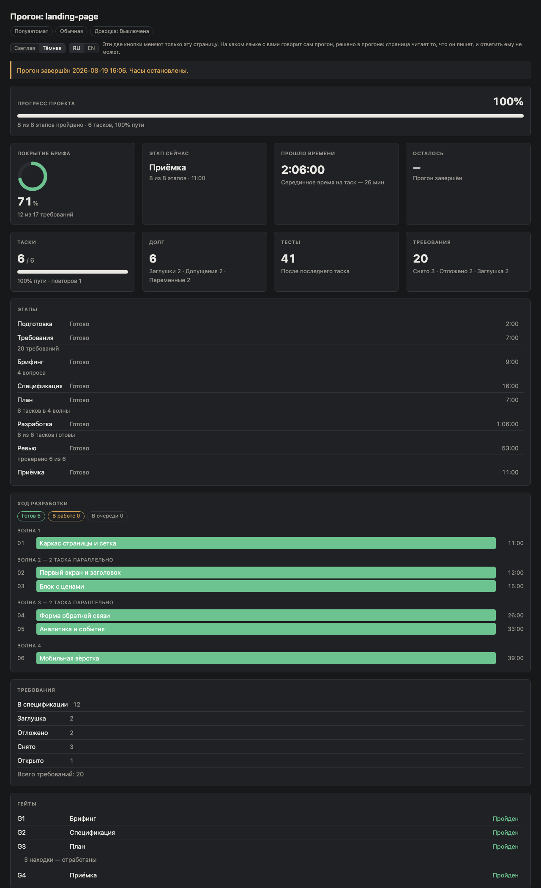

# The Dashboard

One self-contained HTML file, copied into `.maestro/` during preflight and
opened for the user at that moment. It reads `state.js` on its own, on a short
interval, because the orchestrator is often busy for minutes at a time and a
view that waits to be told to refresh shows a run that looks frozen.

Its only input is the run state — carried twice: as a snapshot written into the
page, and as `state.js` beside it. The snapshot is what lets the page show a
прогон when it is opened with no address at all, which is what an in-app pane
does to it; the file is what makes the clocks move. Whichever loaded last wins,
and a load that fails never replaces a state that worked. It never opens
`manifest.md`, a task file, or any path in the repository — a view that reaches into artifacts becomes a second
source of truth about a run, and the second one is silently wrong.

## A run in flight


The page opens with one bar: how much of the прогон is behind you. It is
weighted by how long each stage takes rather than counting stages equally, and
inside разработки it is subdivided by **how far the таски have got** — so it
creeps with the work instead of standing still for an hour and then jumping.

**Not by how many are finished, and the difference is hours long.** A таск is
marked `done` by the ревью phase, which runs after разработка, so a bar counting
only finished таски stands at its floor for the whole of the longest stage. Each
status carries its own share instead: `done` a whole one, `review` 0.8,
`repair` and `running` a half, `queued` nothing. That is the same scale
«Осталось» grades the remainder by, read from the other end, so the two numbers
cannot disagree about the same таск — and it means the bar can fall, which it
should: a таск sent from ревью back to ремонт lost work, and a bar that only
ever rises would hide exactly that.

Beneath it are eight cards. Four of them answer «где мы» — покрытие брифа, этап
сейчас, прошло времени, осталось — and four answer «что осталось закрыть» —
таски, долг, тесты, требования. Every one of those numbers is computed from the
run state at render time; none is stored.

**Осталось is a range and refuses to be sharper.** It is the median of finished
таски measured along the remaining critical path, and below two finished таски
it says *рано считать* rather than guessing.

The `Таски` card keeps the two apart on purpose: the big figure is the count of
**accepted** таски and the bar behind it runs further, in a second, muted
segment, for the work in flight. Before that, the card read «0 / 6» above a bar
filled to 38% and the words «38% готово» — three numbers about one thing, two of
them disagreeing.

The stage timeline is the run: eight stages in order, the current one marked,
each with the one-phrase note the phase left and its own duration.
Every visible word comes from `docs/spec/vocabulary.md` — the state stores ids
and the page resolves them at render time, so a wording change never requires a
state migration. Those words are Russian, because the interface is: the
screenshots show `Разработка` where this page says the build stage, and the
mapping between the two is the vocabulary file.

The build block shows what is happening now, grouped by wave. A wave is one
layer of the plan — `1 + max(wave of its blockers)`, then split so that no two
таски in a wave write the same files — and it is numbered once, when the таски
are cut. The build still launches anything whose blockers are done; what it does
not do is renumber, because rows jumping between groups read as a lost plan.

The «N тасков параллельно» on a wave is read from the clocks rather than from
the size of the wave. A layer says what *may* run together; only the timestamps
say what did.

**A таск whose status the state contract does not define is shown, not lost.**
It gets a chip of its own — «Вне контракта» — its status printed in the row as
it was written, and no share of the bar. A real прогон wrote a таск `pending`,
which is a стадия's word, and the chips then summed to five against a total of
six: a page whose own numbers disagree has stopped being a record. The page
never repaints such a таск into a status that does exist — guessing is the
writer's job, and this page is the reader.

Requirement coverage is counted rather than claimed: every task carries the
requirement ids it traces to, which is what G3 checks in both directions.

## A finished run



After `finishedAt` the page stays a readable record with every clock stopped,
and each stage shows its own duration rather than the run's. A frozen clock with
no explanation is the one failure mode the header notice exists to prevent: an
interrupted run says it was interrupted and when.

Under `G3` in the checks block is the line a passed check shows when it left
findings behind: how many there were, and that they were acted on. It opens the
list on a press and it is not painted in the colour of failure — a check is
never passed with a finding still standing, so what is folded there is a record
of work already done, not a list of problems.

## The two switches in the header

Beside the dials are two controls that belong to whoever is reading, not to the
run: the theme and the language of the page. Each has three states — light,
dark, and *neither chosen*; `ru`, `en`, and *neither chosen* — and until a
button is pressed there is no choice at all: the theme follows the screen the
page was opened on, and the language follows what the run decided.

A press is remembered by the browser and nothing else. Neither control reaches
the run: the page reads `state.js` and has no way back, so the language button
repaints this page and cannot change the language the run speaks in. The line
beside the buttons says so, because a control that looks like it does more than
it does is worse than no control.

## The fixtures behind these images

`docs/assets/state-running.fixture.js` and `state-finished.fixture.js` are the
two states the screenshots were rendered from. They are fixtures, not the record
of a real run — a real one belongs to the project it built and is never
committed here.

To reproduce a capture:

```bash
mkdir -p /tmp/shot && cp skills/maestro/assets/dashboard.html /tmp/shot/
cp docs/assets/state-finished.fixture.js /tmp/shot/state.js
"/Applications/Google Chrome.app/Contents/MacOS/Google Chrome" \
  --headless --disable-gpu --hide-scrollbars --allow-file-access-from-files \
  --virtual-time-budget=4000 --window-size=1280,2100 \
  --screenshot=docs/assets/dashboard-finished.png file:///tmp/shot/dashboard.html
```

The clocks in a capture of the in-flight state are measured against the moment
of the capture, so re-running the command produces a different image. That is
the page working, not the fixture drifting.

## Asking what a number means

Every region carries a small `i` — the cards, the bars, the blocks, and the row
of dials in the header. Pressing it opens one popover, and there is exactly one
popover on the page: moving it is what closes the previous explanation, so
nothing shifts under you while you read about the number you are looking at.
Escape closes it, so does a click anywhere else.

What it says is about **your прогон**, not about dashboards. «Осталось» does not
explain that it holds an estimate; it says the estimate is 18…31 минуты, that
the median behind it came from two finished таски, and that the chain it was
measured along is three таски long. Before there is anything to say, it explains
the empty state instead — which is when you are least able to guess. Each
explanation is built by calling the same functions the region draws itself with,
so it cannot tell you a story the number above it disagrees with.

**In which words depends on how you answered the first question of the project.**
If you chose *по-простому*, every one of the fourteen explanations is written for
someone who has never built software — «Осталось» stops saying *медиана* and says
*серединное время*, and the block called «Гейты» opens with what the four checks
actually are. The figures are identical: both versions call the same functions,
because an explanation that recomputed its own numbers could disagree with the
one beside it, and the plain reader is the last person able to notice.

The row of dials shows a fourth chip when the run recorded an answer —
«Объяснения: Простые» — and shows nothing there when it did not. A прогон from
before this question existed renders exactly as it always did; the page does not
report a choice nobody made.

The names on the screen do not change. A *таск* is a *таск* in both, «Гейты» is
«Гейты» in both, and the rows are still numbered `G1`…`G4`. Renaming them for a
beginner would leave you reading a page whose words appear nowhere in what you
were told; the `i` beside each block is what teaches the word instead.

## When the page has nothing new to say

A прогон writes its state at transitions and at no other time, so quiet
stretches are normal — the манифест can think for ten minutes and say nothing.
A прогон that has *stopped* is quiet in exactly the same way, and that is the
harder case: a stage that never closed leaves its clock running, and a session
that died sets no interruption to stop it.

So the page says how long ago the state was last written, and raises the line
once that is longer than the longest quiet stretch this run has already come
through. The threshold is the run's own — ten minutes of silence is unremarkable
in a прогон that has already been quiet for eleven, and alarming in one that
writes at every таск. A finished or interrupted прогон is not nagged about it:
that silence is accounted for, and the page already says so.

## What is checked

`npm run dashboard` proves the page is self-contained — no CDN, no external
stylesheet, no font fetch, no network API — and that the labels, stage order and
gate map it carries still match `vocabulary.md`, `phases.md` and `gates.md`. It
also checks the words that belong to no field at all: every card and block name
the vocabulary owns has to appear on the page, because a card renamed on the
page and nowhere else is drift no value map can see. The
page holds those copies because the state stores ids; an unchecked copy drifts.

It holds the regions to `spec/dashboard.md` as well. Every region named there
must be marked once in the markup, must have somewhere to hang its `i`, and must
have an explanation that answers when called — **in both registers**, and in
both directions, so a region added to the page and forgotten in the table fails
too, and one explained only for the reader who did not need it fails as well. A
region cannot ship mute.

It also holds the plain explanations to the shorthand list in `vocabulary.md`:
no plain sentence the page ships may contain `гейт`, `спека`, `коммит`, `стейт`
or the rest of them. The block is read as source rather than called, because a
branch never taken still ships — and a region's empty state, the branch a
fixture is likeliest to forget, is exactly where the reader is least able to
guess. A label the screen shows is exempt in its exact form: «Гейты» is on the
page in both registers, and the popover that has to teach it cannot be forbidden
from naming it. «после гейта» in the same sentence still fails.

**Reading the block is not the whole of it.** Some plain wording lives in a
function shared by both registers rather than in the explanations — the silence
notice, and the line a passed check shows above its folded findings. Source
reading cannot see those: what is written there is a template and a branch, and
the sentence the user reads does not exist until the function runs. So the check
**calls** them, with each register and each language, and holds the answer to
the same list. The folded findings line is called at several counts as well,
because Russian takes three plural forms and any one number exercises only one
of them. A function the page stops exporting is reported rather than skipped: a
check silently not running is indistinguishable from a check that passes.

**The sentences the view composes are read too**, and this is where the rule
bites hardest. Every label, chip and one-line summary the page assembles lives
in one map per language, shared by both registers, and that map is read as
source — so *every branch of it* has to survive the plain list, including the
one the plain reader never reaches. That is why the median line says «серединное
время» rather than «медиана» in both registers, and why the folded findings line
names neither the check nor its status: `normal` is *allowed* the trade's words,
never owed them, and a sentence that has to differ by register belongs in a
called function instead.

Its DOM-free logic is exercised separately by `scripts/validate/dashboard-logic.test.ts`,
which evaluates the page's own `<script id="logic">` block in a VM rather than
reimplementing it.

The behavior this page owes the user is specified in
[`spec/dashboard.md`](spec/dashboard.md).
